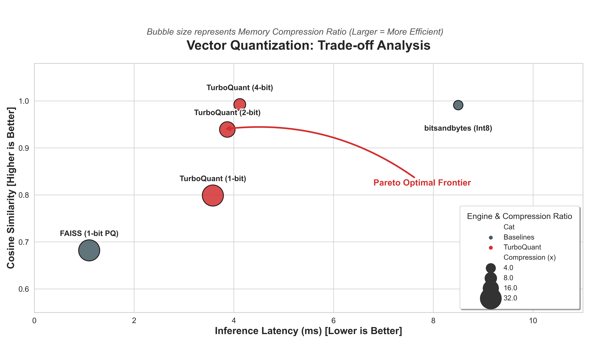

#  TurboQuant-PyTorch
### **高效能向量量化引擎：專為 LLM 與大規模檢索設計 以 Pytorch C++實作 **

[](https://www.python.org/)
[](https://pytorch.org/)
[](https://opensource.org/licenses/MIT)

[English Version](#english-version) | [繁體中文版本](#繁體中文版本)

---

## 💡 為什麼選擇 TurboQuant？

**TurboQuant** 是一個針對大型語言模型 (LLM) 與向量搜索應用設計的高效能量化函式庫。我們將核心運算下沉至 C++，並結合數學優化技術，在大幅降低記憶體佔用的同時，保持近乎無損的精度。

### ✨ 核心亮點
* **極致 C++ 加速**：核心矩陣旋轉 (Rotation)、投影 (Projection) 與量化邏輯採用 C++/LibTorch 深度優化，實現毫秒級推理。
* **Lloyd-Max 數學優化**：基於 Scipy K-Means 自動計算高斯分佈的最優質心 (Centroids)，讓量化更精準。
* **無偏殘差補償 (Unbiased Residual)**：利用 QJL 符號位元保留向量的方向與模長，解決深層神經網路中的累積誤差問題。
* **智慧矩陣快取**：自動緩存訓練好的質心 ($\mathcal{C}$) 與正交矩陣 ($\Pi, S$)，實現引擎「秒開」啟動。
* **高度彈性自訂**：完美支援任意維度 $d$ 以及 1-bit 到 8-bit 的動態位元率切換。

---

## 效能表現 (Benchmark)



### **如何解讀這張圖表？**
* **縱軸 (Fidelity)**：餘弦相似度 (Cosine Similarity) 越高，代表向量還原度越精準。
* **橫軸 (Latency)**：越往左代表 C++ 執行速度越快。
* **圓圈大小 (Memory)**：**圓圈越大，代表記憶體壓縮率越高！**
    * **1-bit**: 32倍壓縮 (最大圓圈)
    * **2-bit**: 16倍壓縮
    * **4-bit**: 8倍壓縮
    * **Int8 (基準線)**: 4倍壓縮 (最小圓圈)

---

##  安裝教學

```bash
# 複製專案
git clone [https://github.com/ericoder960803/TurboQuant.git](https://github.com/ericoder960803/TurboQuant.git)
cd TurboQuant

# 以可編輯模式安裝 (系統會自動編譯 C++ 擴展)
pip install -e .
```
## 應用範例 
### 1. LLM KV-Cache 管理 (節省 16 倍記憶體)
適用於 Llama-3 等長文本推理場景，解決 KV-cache 導致的記憶體瓶頸。
```python
# 2-bit 量化可將 4KB 的資料壓縮至 0.25KB
kv_manager = TurboQuantKVCache(dim=4096, bits=2)
kv_manager.push(torch.randn(4096)) # 壓縮並存入 Key
keys = kv_manager.fetch_all()      # 還原後進行 Attention 運算
```
### 2. 高速向量檢索
為向量資料庫或 RAG 系統提供高還原度、低存儲佔用的方案
```python
import torch
from turboquant import TurboQuantEngine

# 1. Setup Database (10,000 vectors)
D, B = 1024, 2
engine = TurboQuantEngine(d=D, b=B)
database = torch.randn(10000, D)

# 2. Offline Compression
compressed_db = [engine.encode(v) for v in database]

# 3. Online Search
query = torch.randn(D)
reconstructed_db = torch.stack([engine.decode(*p) for p in compressed_db])
scores = torch.nn.functional.cosine_similarity(query.unsqueeze(0), reconstructed_db)

# 4. Get Top-K
top_values, top_indices = torch.topk(scores, k=5)
print(f"Top Indices: {top_indices.tolist()}")
```
### 數學原理
重建後的向量 $\hat{x}$ 計算公式如下：
$$\hat{x} = \Pi^T ( \mathcal{C}_{idx} + \gamma \cdot \sqrt{\frac{\pi}{2d}} \cdot S^T q_{jnl} )$$
Where:
- $\Pi$: 正交旋轉矩陣 (Orthogonal Rotation Matrix)
- $\mathcal{C}$: Lloyd-Max 最優質心 (Optimal Centroids)
- $S$: QJL 投影矩陣 (Projection Matrix)


---

## 引用 (Citation)

如果您發現 TurboQuant-PyTorch 對您的研究或專案有所幫助，請引用原論文：

### 原論文 (arXiv:2504.19874)
@article{zandieh2025turboquant,
  title={TurboQuant: Online Vector Quantization with Near-optimal Distortion Rate},
  author={Zandieh, Amir and Daliri, Majid and Hadian, Majid and Mirrokni, Vahab},
  journal={arXiv preprint arXiv:2504.19874},
  year={2025}
}

### 本實作項目
@misc{ericliam2026turboquant,
  author = {Eric Liam},
  title = {TurboQuant-PyTorch: High-Performance C++/LibTorch Implementation},
  year = {2026},
  publisher = {GitHub},
  howpublished = {\url{https://github.com/ericoder960803/TurboQuant-PyTorch}}
}
